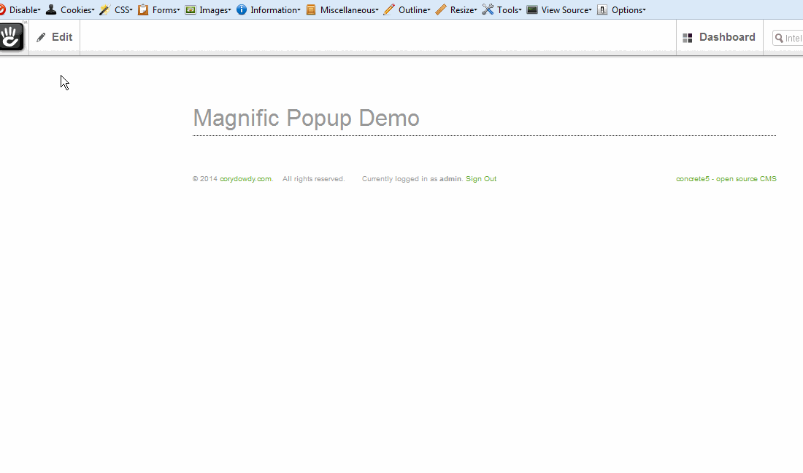
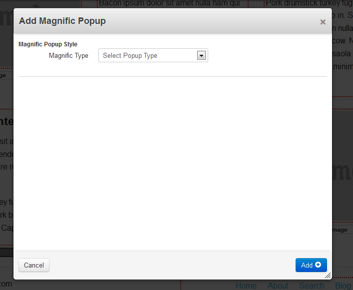
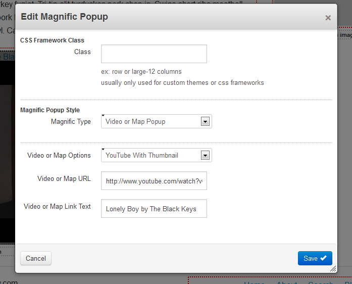
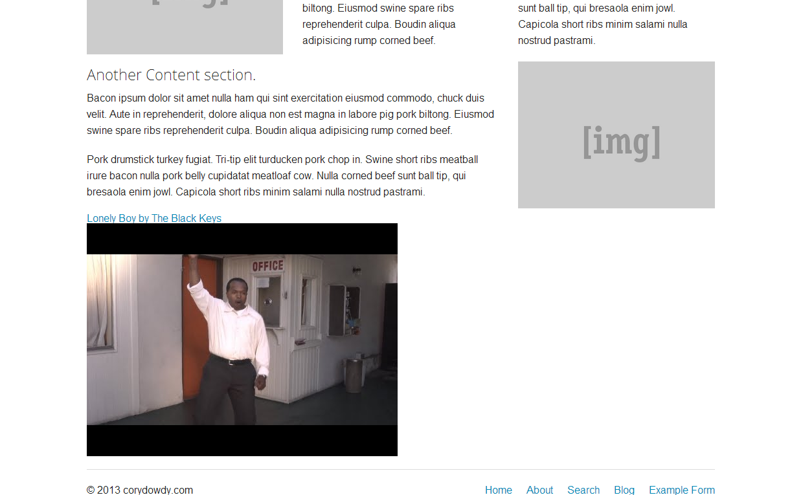
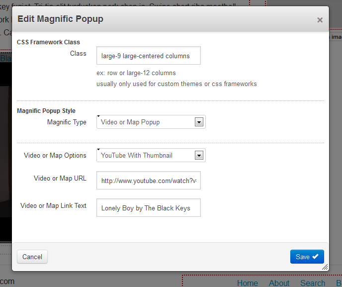
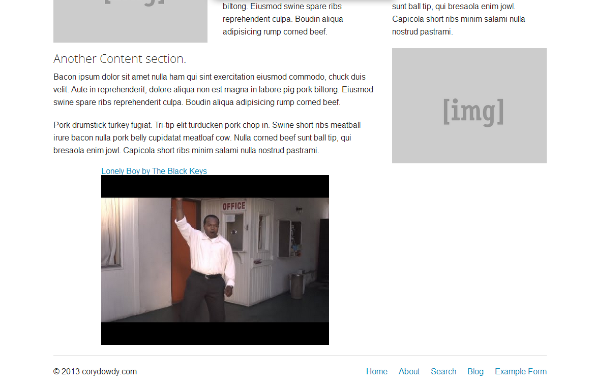
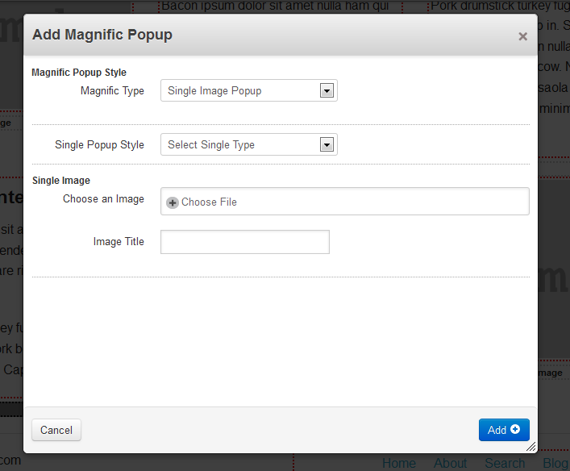
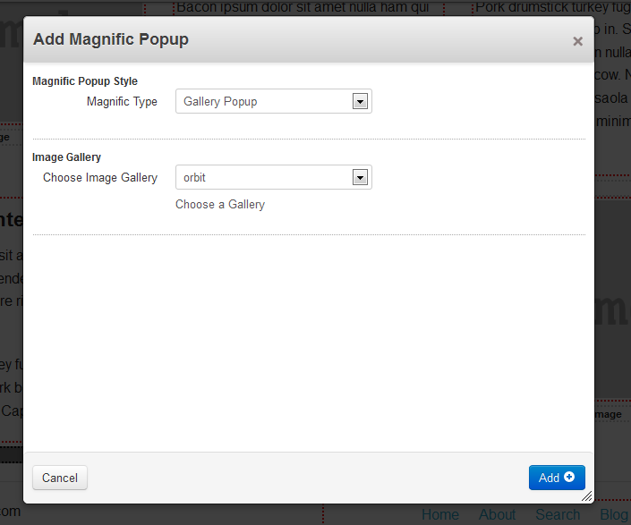
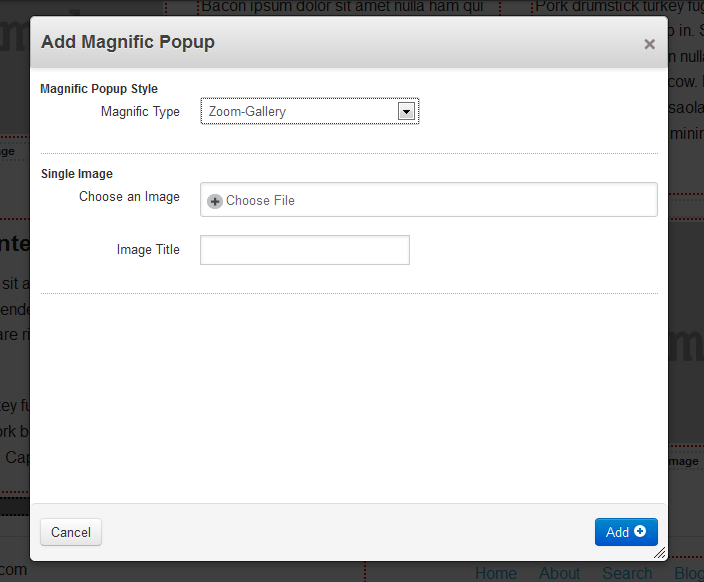
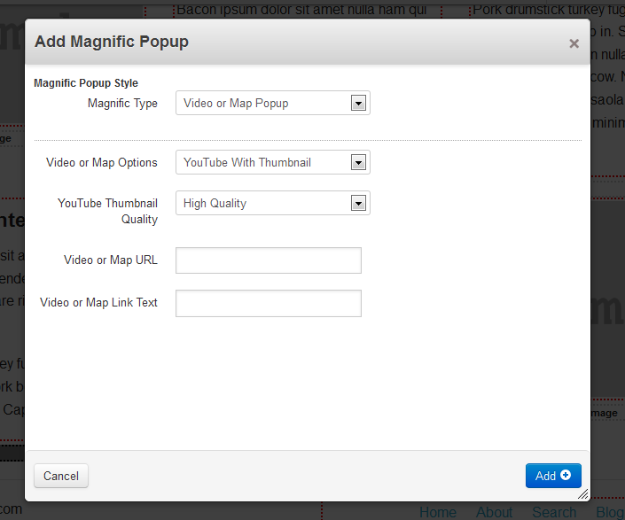

Concrete5 Magnific Popup Add-on Package
=======================================

Dmitry Semenov's Magnific Popup Responsive Lightbox Plugin in a Concrete5 Add-On Package.
Minimum Concrete5 Version for this Add-on is 5.6.0  

**DEMO**



This Project uses the following:
-------------------------------------
- Magnific Popup http://dimsemenov.com/plugins/magnific-popup/ or @dimsemenov (https://github.com/dimsemenov/Magnific-Popup).  
- Jquery VimeoThumb.js its one of the easier ways if not the easiest way to grab Vimeo Thumbnails
- https://github.com/Ideame/jquery-vimeothumb  
- and of course Concrete5:  http://www.concrete5.org/

This Concrete5 add-on has:
--------------------------
- Single Image Lightbox
- Zoom Image Lightbox
- Gallery Image Lightbox
- Video and Map Lightbox w/optional youtube or vimeo thumbnail
- Dialog Lightbox with CSS animations  
- Modal Lightbox
- current version # is 1.0.0

Installation:
-------------

1. clone/fork/download zip. or head over to releases (https://github.com/cdowdy/concrete5-Magnific-Popup/releases)
2. unzip and move the top-level ```magnific_popup``` folder to ```[SITE_ROOT]/packages``` directory.  
3. In the Concrete5 Dashboard go to "Extend Concrete5".  
4. Magnific Popup should be waiting for installation.


To Do's
------
- [ ] create webp fallback images (progressive jpg/transparent png) and have them load automagically for unsupported browsers.
- [x] css dialog support.  
- [x] modal support
- [ ] add image previews to gallery and possibly sorting order.
- [x] move inline block javascript to footer (done! page speed rules should be a bit happier).
- [x] fully implement CSS framework input (only does divs, probably best to leave ul's to templates).
- [ ] fig and figcaption? 
- [x] ~~bing maps. (added but it isnt fullscreen lightbox).~~ Removed. it was ugly and I've gone full dumb on how to fix it. 
- [x] install icon needs to be made.
- [x] add block icon needs to be made.
- [x] screenshots.


Screenshots
-----------
**Main Add/Edit window**  

  
**CSS Dialog**  

  
**No CSS Output**  
  
**CSS using Zurb Foundation 5 framework**  
  
**CSS Output after using Foundation CSS class**
  
**Single Image Lightbox**  

    

**Gallery LightBox**  

  

**Zoom Image Lightbox**  

  
  
**Video Or Map LightBox**  

  

**CSS Animation**  

  

  


